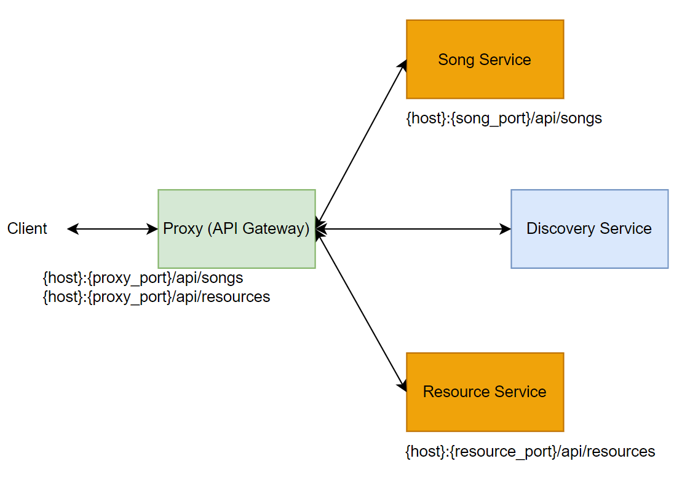
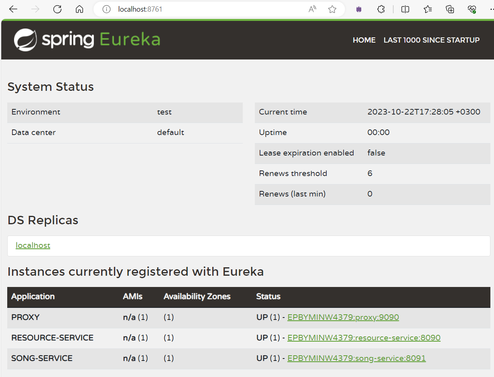

# SD-eureka-discovery-server

This service implements Eureka for service registry and discovery. High-level overview:

By default, spring boot application and Eureka are exposed on port 8761. Eureka info could be found on [http://{host}:8761/](http://localhost:8761/).

## Other components:
1. [API Gateway](https://github.com/LizaSamodumkina/SD-cloud-gateway-service)
2. [Song Service](https://github.com/LizaSamodumkina/MAO-song-service)
3. [Resource Service](https://github.com/LizaSamodumkina/MAO-resource-service)
